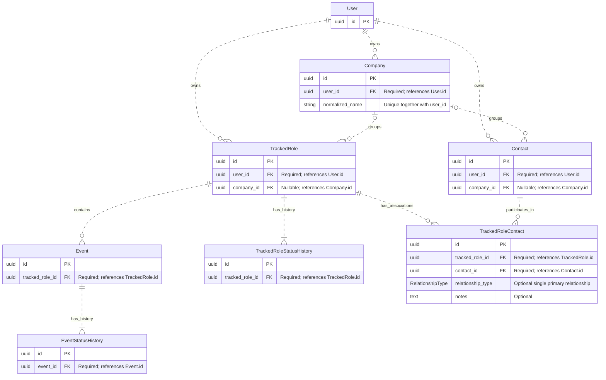

# Huntly V1 Entity Relationship Diagram

This diagram documents the V1 relationships from the relationship
specification. It describes the intended domain model. See also the [V1 domain specification](../backend/docs/domain-v1.md).

Only identifiers and relationship-relevant attributes are shown; other entity
attributes and common timestamps are omitted.

## Cardinality and constraints

- `||` means exactly one, `o|` / `|o` means zero or one, `o{` means zero or
  more, and `|{` means one or more. Dotted lines denote non-identifying
  relationships: each entity has its own primary key. They do not indicate
  optionality or ownership.
- Every `Company`, `TrackedRole`, and `Contact` has exactly one `User` through a
  required `user_id`. A user may have zero or more of each.
- A `TrackedRole` or `Contact` may have zero or one `Company`. An unknown company
  is represented by `company_id = NULL`, never a placeholder "Unknown Company"
  record. A company may have zero or more roles and contacts.
- Company names are unique per user through
  `UNIQUE(user_id, normalized_name)`. Different users may each have their own
  company with the same normalized name.
- An `Event` requires a `TrackedRole` and cannot exist independently of it.
- Every successfully created `TrackedRole` and `Event` must have at least one
  corresponding history record: the initial transition from `NULL` to its
  explicitly selected initial status. The `1..*` history cardinalities express
  this creation rule; a foreign key alone does not enforce the minimum count.
- `TrackedRole` and `Contact` have a many-to-many relationship through the explicit
  `TrackedRoleContact` association object. Each association requires both foreign
  keys and is unique through `UNIQUE(tracked_role_id, contact_id)`.
- `TrackedRoleContact.relationship_type` is an optional single primary relationship:
  `RECRUITER`, `HIRING_MANAGER`, `INTERVIEWER`, `REFERRAL`, `TEAM_MEMBER`, or `OTHER`.
  Association notes describe that contact's relationship to that particular role.

## Direct and inherited ownership

Only `Company`, `TrackedRole`, and `Contact` directly reference `User`. Other
entities inherit ownership through their parents rather than having an independent
`user_id`:

| Entity                     | Ownership path                                      |
| -------------------------- | --------------------------------------------------- |
| `Company`                  | `Company → User` (direct)                           |
| `TrackedRole`              | `TrackedRole → User` (direct)                       |
| `Contact`                  | `Contact → User` (direct)                           |
| `Event`                    | `Event → TrackedRole → User`                        |
| `TrackedRoleStatusHistory` | `TrackedRoleStatusHistory → TrackedRole → User`     |
| `EventStatusHistory`       | `EventStatusHistory → Event → TrackedRole → User`   |
| `TrackedRoleContact`       | `TrackedRoleContact → TrackedRole / Contact → User` |

All reads, updates, associations, and deletions must respect the authenticated
user's ownership. A `TrackedRoleContact` may only connect a role and contact owned
by the same user. Company associations must also stay within that user's data.

## Deletion behavior

| Deleted entity | Required effect                                                                                                                                             |
| -------------- | ----------------------------------------------------------------------------------------------------------------------------------------------------------- |
| `User`         | Eventually delete all user-owned Huntly data. The exact account-deletion implementation is deferred.                                                        |
| `Company`      | Keep its roles and contacts; set their `company_id` values to `NULL`.                                                                                       |
| `TrackedRole`  | Delete its `TrackedRoleStatusHistory`, events (including their `EventStatusHistory`), and `TrackedRoleContact` associations. Keep contacts and the company. |
| `Event`        | Delete its `EventStatusHistory`. Keep the parent role.                                                                                                      |
| `Contact`      | Delete its `TrackedRoleContact` associations. Keep roles and the company.                                                                                   |

Removing an association never deletes the independently owned entity at its other
end. These deletion rules are explicit domain requirements; diagram line styles
do not encode cascade behavior.
